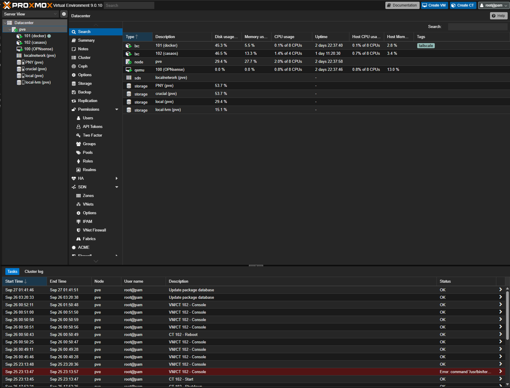

# Proxmox Virtual Environment (PVE) as the main Operative System
https://www.proxmox.com/
## Key Features Used in this project
- **Full Virtualization**: Supports KVM (Kernel-based Virtual Machine) to run full operating systems.
- **Lightweight Virtualization**: Supports LXC for high-performance Linux containers.
- **Web-Based Management Interface**: Centralized administration through an intuitive graphical web console.
- **Advanced Networking**: VLANs, bridges, and Software Defined Networking (SDN) support.
- **Integrated Storage Management**: Supports ZFS, Ceph, NFS, iSCSI, and more.
- **Rapid Deployment Using Comminity Scripts**: https://github.com/community-scripts/ProxmoxVE

## Key features for futures projects
- **Clustering**: Ability to group multiple Proxmox nodes for distributed infrastructure management. (Future project -> need more hardware)
- **High Availability (HA)**: Automatic management of critical services in case of failure.
- **Snapshots & Backups**: Advanced snapshot and backup management for VMs and containers.
- **REST API**: Automation and integration capabilities via API.

## Typical Use Cases
- Hosting multiple operating systems on a single physical server.
- Deploying development or **testing** environments.
- Homelab or data center infrastructure.
- Centralized management of virtual machines and containers for production.

## Proxmox VE web UI
