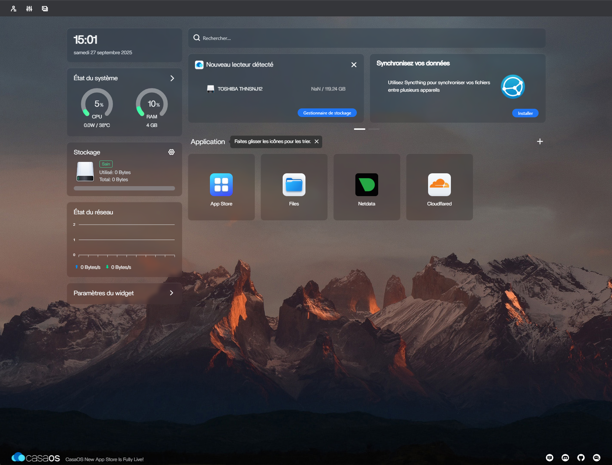

# CasaOS

**CasaOS** is an open-source, user-friendly home cloud system designed to simplify self-hosting.  
It provides a modern and intuitive web interface to deploy, manage, and access applications and services in a personal cloud environment. https://casaos.zimaspace.com/

## Key Features
- **App Store Integration**: Easily install and manage containerized applications with one click.
- **Docker**: Runs applications in Docker containers for flexibility and portability.
- **Web-Based Dashboard**: Clean and intuitive interface for managing apps, storage, and users.
- **File Management**: Built-in file browser for organizing and accessing personal files.
- **Cross-Platform**: Works on Raspberry Pi, x86 servers, and ARM-based devices.
- **Community Driven**: Open-source with an active ecosystem of contributors.
- **Lightweight**: Optimized for low-power devices, ideal for homelab use.

## Typical Use Cases
- Centralized application management for a homelab.
- Hosting lightweight services and personal apps.
- Creating a **simple** home cloud interface for file storage and backups.

## Casa OS dashboard
