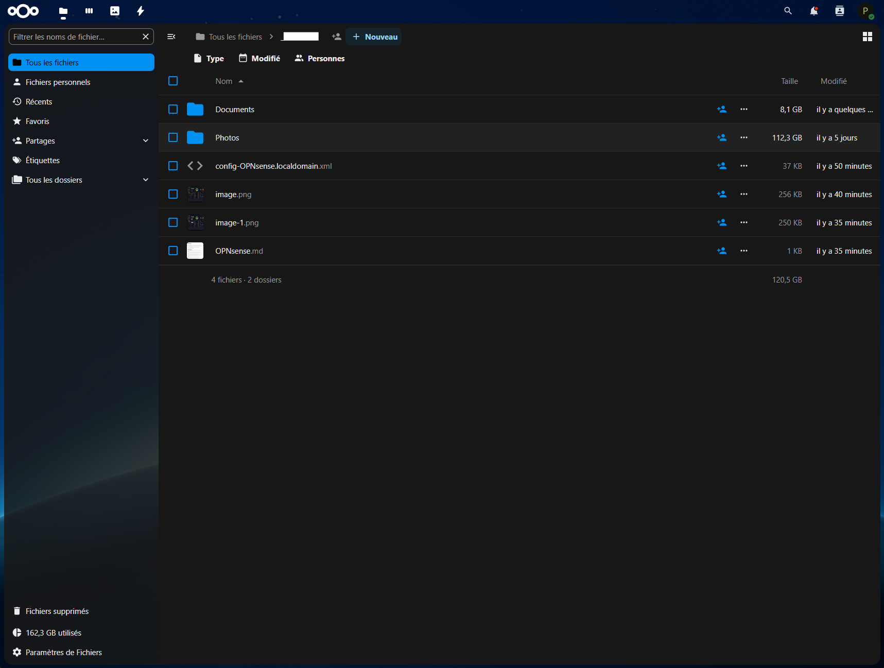
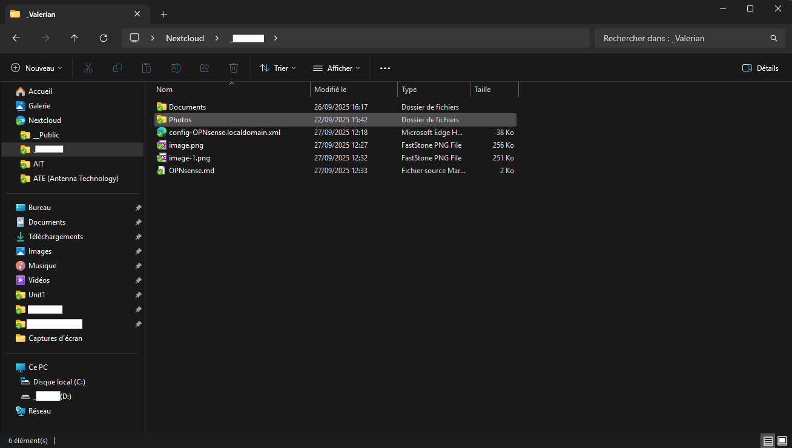
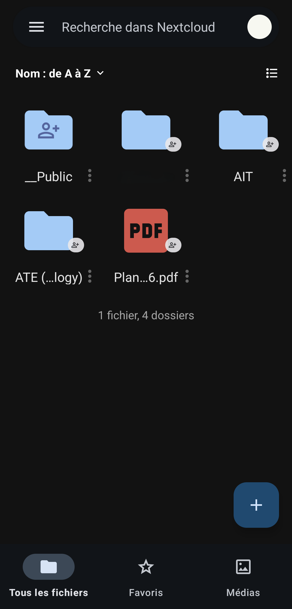

# Nextcloud

**Nextcloud** is an open-source platform for file hosting and collaboration, designed as a self-hosted alternative to cloud services like Google Drive, Dropbox, or OneDrive. It allows individuals and organizations to securely store, share, and collaborate on files while maintaining full control over their data. https://nextcloud.com/

## Key Features
- **File Synchronization & Sharing**: Access files across devices (desktop, mobile, web) with advanced sharing controls.
- **Collaboration Tools**: Integrated calendar, contacts, and office suite (with Collabora or OnlyOffice).
- **Security & Privacy**: End-to-end encryption, user access control, and compliance with GDPR.
- **Extensible**: Rich ecosystem of apps for tasks, notes, password management, and more.
- **Cross-Platform**: Available on Linux servers, Docker containers, and major operating systems for clients.
- **Scalability**: Suitable for personal use, SMBs, or enterprise-level deployments.

## Typical Use Cases
- Building a personal or family cloud to replace third-party services.
- Hosting documents, photos, and backups in a secure environment.
- Collaborative workspaces for teams (file editing, calendars, chat).
- Serving as a self-hosted hub for productivity apps in a homelab setup.

## Nexcloud Web UI

## Necloud Client (Windows explorer)

## Nexcloud Client (Android app)

