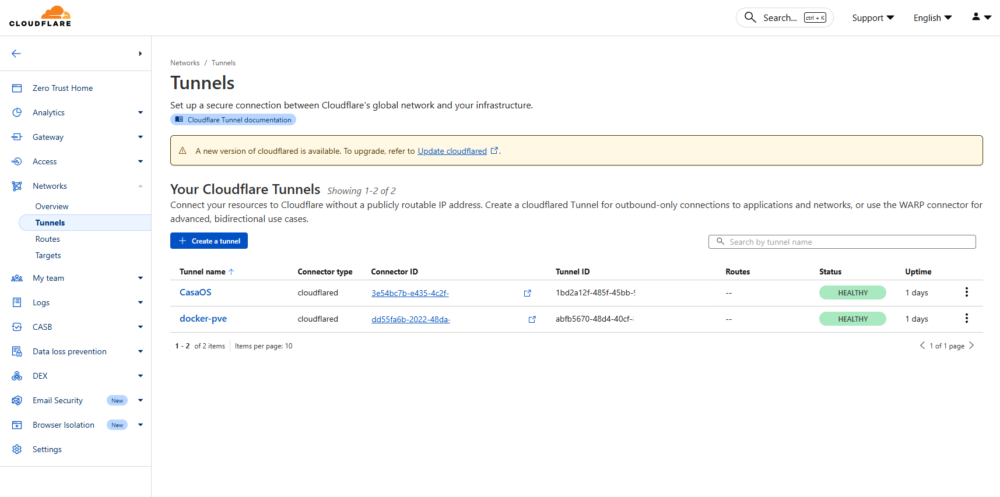

# Cloudflared

**Cloudflared** is the command-line client developed by Cloudflare to securely connect a local service or network to the Cloudflare edge.  
Its most common use is to create a **Cloudflare Tunnel**, allowing applications hosted in a private homelab to be exposed to the internet without opening inbound ports on the router or firewall.  

By leveraging **Cloudflare One** and **Zero Trust** principles, cloudflared ensures secure, authenticated, and monitored access to internal services.

## Key Features
- **Cloudflare Tunnel**: Expose local services securely to the internet through an outbound connection only.
- **Domain Integration**: Bind internal services to a custom domain purchased and managed through Cloudflare, with automatic HTTPS/TLS certificates.
- **Zero Trust Access**: Enforce identity-based access policies (SSO, MFA, device posture checks).
- **Built-In Security**: Benefit from Cloudflare’s global security features:  
  - DDoS mitigation  
  - Web Application Firewall (WAF)  
  - Bot management  
  - Rate limiting
- **Cloudflare One Integration**: Centralized Zero Trust platform for secure access, monitoring, and traffic filtering.
- **Lightweight & Flexible**: Runs as a simple service/daemon on Linux, Windows, or Docker.
- **No Router Configuration Needed**: Unlike a traditional VPN (e.g., WireGuard), no port forwarding or firewall rule modification is required.

## Typical Use Cases
- Publishing homelab services (Nextcloud, TrueNAS, web dashboards, media servers) securely on a custom domain.
- Providing remote access to private applications with authentication and access rules.
- Replacing or complementing VPN solutions with a **Zero Trust approach**.
- Enhancing security and performance when exposing services to the public internet.

## My Opinion

For me, **cloudflared is one of the best alternatives to peer-to-peer VPNs** when it comes to securely accessing homelab services from outside the local network.  
The biggest advantage is that it requires **no changes to router settings** (no port forwarding or firewall reconfiguration), which makes it very convenient compared to traditional setups.

### Pros
- **Higher performance than relayed VPNs** (e.g., Tailscale over DERP servers).  
- **Simple and lightweight deployment** — just run the client and link it to your Cloudflare account.  
- **Built-in Zero Trust security** with Cloudflare One integration.  

### Cons
- **Domain required**: you need a custom domain (Cloudflare offers affordable options, mine costs ~10€/year).  
- **Performance depends on Cloudflare’s PoP locations**: for example, during my long-term test between Paris ↔ Madrid, I averaged ~350 Mbps up/down.  
- **Not as fast as pure P2P VPNs like WireGuard**, which are only limited by your ISP’s upload/download bandwidth.  

## Cloudflare One dashboard

