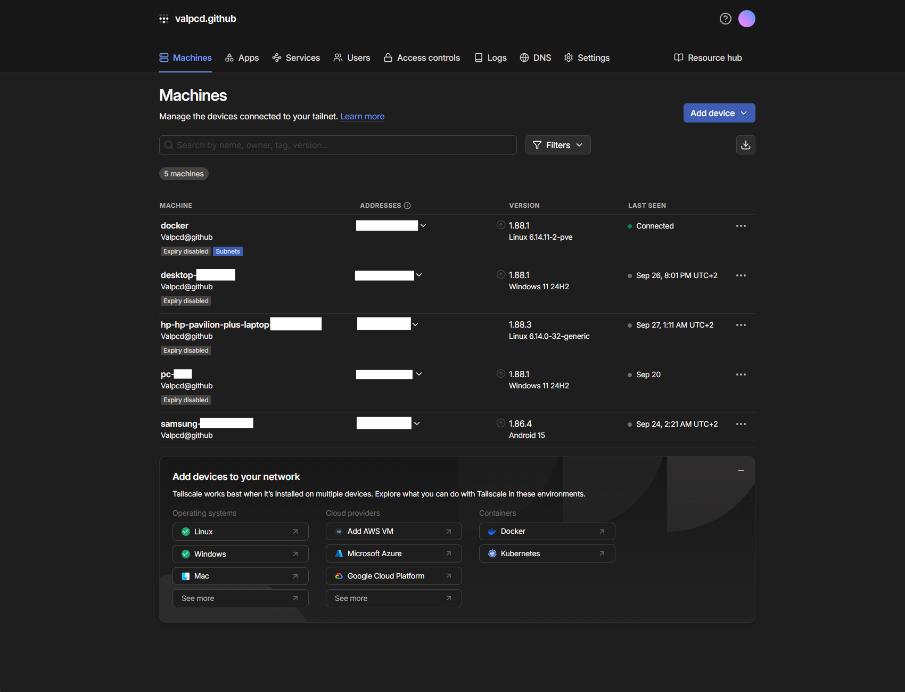

# Tailscale

**Tailscale** is a peer-to-peer (P2P) VPN solution built on top of WireGuard, designed to simplify secure remote access.  
It creates a private mesh network between devices, allowing them to communicate directly without complex VPN configurations or firewall changes. https://tailscale.com/

Tailscale emphasizes ease of use, security, and minimal configuration, making it ideal for both personal homelabs and professional environments.

## Key Features
- **Peer-to-Peer VPN**: Connect devices directly over WireGuard tunnels with minimal latency.
- **No Manual Port Forwarding**: Automatically handles NAT traversal and firewall rules.
- **Zero Trust Access**: Integrates with identity providers for authentication and access control.
- **Cross-Platform**: Works on Linux, Windows, macOS, iOS, Android, and more.
- **Simple Setup**: Install and authenticate with your account to join the network.
- **Access Control**: Fine-grained access policies per device and user.
- **Mesh Networking**: Direct connections between devices when possible for low-latency communication.
- **Automatic Key Management**: WireGuard keys are handled securely and automatically.
- **Audit Logs**: Visibility into connections and access events.

## Typical Use Cases
- Securely access a homelab or personal network without modifying router configurations.
- Create a private network between devices spread across different locations.
- Remote development and testing without exposing services publicly.
- Enforcing Zero Trust principles in a small-scale environment.

## My Opinion

Tailscale is one of the **simplest and most effective VPN solutions** I have used for remote access.  
Its ease of implementation across all major operating systems makes it a go-to choice for quickly connecting devices without complex configuration.

### Why I like Tailscale:
- 🌍 **Cross-platform simplicity** — works on Linux, Windows, macOS, iOS, Android, and more with minimal setup.  
- 🛠 **Centralized admin console** — structuring and managing access for all devices is straightforward and intuitive.  
- ✨ **Magic DNS** — eliminates the need to remember IP addresses when connecting to remote devices, making remote sessions seamless.  
- 🔒 **Zero Trust access** — integrates authentication and access control at the network level.

For me, when I need to connect to my infrastructure remotely, **Tailscale is my go-to solution** for its speed of deployment and simplicity.  

However, when transferring large files (e.g., to Nextcloud), I prefer using a **WireGuard VPN** because it offers significantly higher performance.  
Tailscale is excellent for access and control, but it is not designed for high-speed file transfers.

## Tailscale admin console

