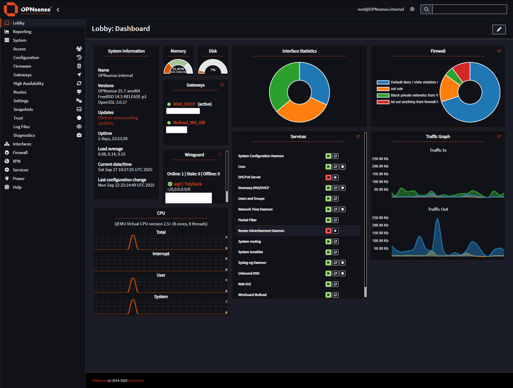

# OPNsense

**OPNsense** is an open-source, FreeBSD-based firewall and routing platform designed for security, flexibility, and performance. It offers a rich set of features for managing network traffic, securing infrastructure, and simplifying network administration. https://opnsense.org/

## Key Features
- **Firewall & Routing**: Stateful packet inspection, NAT, VLANs, and policy-based routing.
- **VPN Support**: IPsec, OpenVPN, and WireGuard for secure remote access.
- **High Availability (HA)**: CARP (Common Address Redundancy Protocol) for failover.
- **Traffic Shaping & QoS**: Control bandwidth and prioritize traffic.
- **Web-Based Interface**: User-friendly graphical interface for configuration and monitoring.
- **Intrusion Detection & Prevention (IDS/IPS)**: Protects against network threats.
- **Reporting & Monitoring**: Real-time dashboards, logs, and analytics.
- **Extensibility**: Plugin system for additional features and services.
- **Automated Updates**: Regular security and feature updates.

## Typical Use Cases
- Securing home or enterprise networks with advanced firewall rules.
- VPN gateway for remote access to private networks.
- Network segmentation and traffic shaping for performance optimization.
- Centralized network security and monitoring in homelabs or production environments.

## OPNsense web UI
